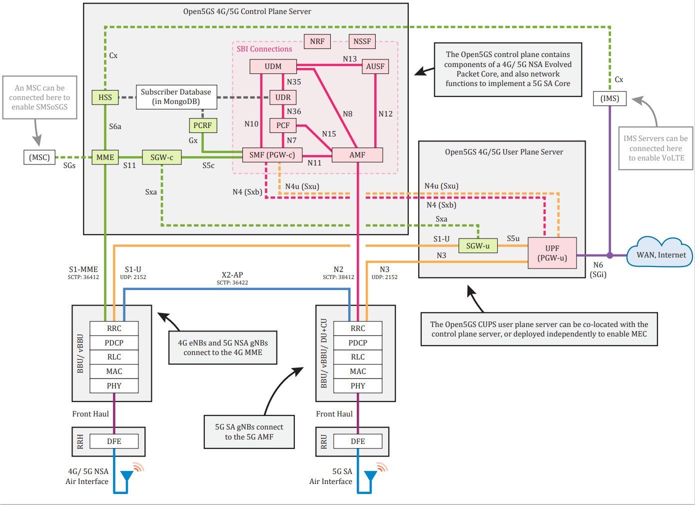
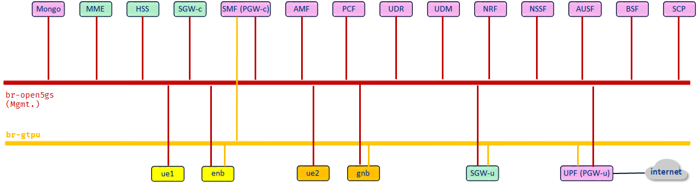
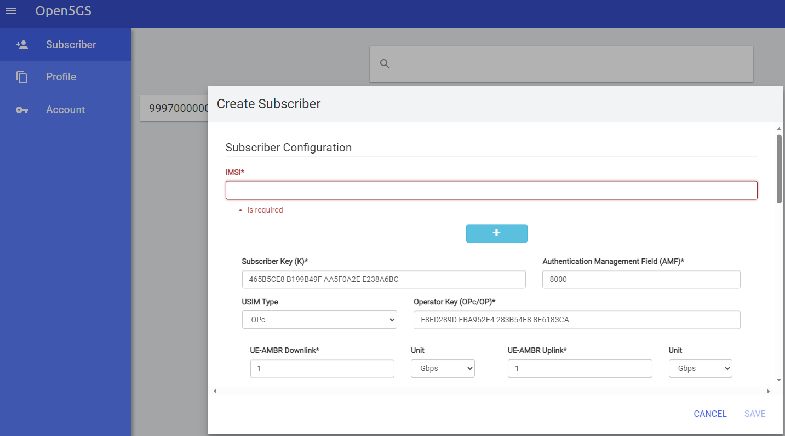

# Open5GS: 4G and 5G LAB deployment using Containerlab

This lab represents a 4G and a 5G Setup built using the following tools:

- Containerlab: https://containerlab.dev/
- Open5GS: https://open5gs.org/
  All containers images used in the lab can be found in Openverso Docker Hub repository: https://hub.docker.com/u/openverso
- SRSRAN (ENB and UE): https://docs.srsran.com/projects/4g/en/latest/index.html
- UERANSIM: https://github.com/aligungr/UERANSIM

Open5GS contains a series of software components and network functions that implement the 4G/ 5G NSA and 5G SA core functions

(source: https://open5gs.org/open5gs/docs/guide/01-quickstart/)

The topology built in this lab consists of creating one separate bridge for gtp-u interfaces while using containerlab Docker Mgmnt bridge for all other interfaces.

The following diagram describes the topology and interconnection between all the components:

Note: Another Lab that uses multiple bridges for 4G/5G interfaces to facilitate the study and integration into other topologies can be found here:
https://github.com/amhaziz/open5gs-clab1

The following steps explain in details how to run and test the setup:

## 1) Download the Lab folder

Download and enter the lab folder:

<pre>
<b>~# cd open5gs2-clab/</b>
<b>~open5gs2-clab# tree -L 2</b>
.
├── configs
│   ├── env-files
│   ├── freeDiameter
│   ├── open5gs
│   ├── orig-files
│   └── tun_create.sh
├── img
│   ├── open5gs.png
│   └── topology.png
├── LICENSE.md
├── logs
│   ├── amf.log
(...)
│   └── upf.log
├── open5gs.yml
├── README.md
└── scripts
    ├── clear_logs.sh
    ├── create_bridges.sh
    ├── register_subscriber.sh
    ├── run_open5gs.sh
    ├── run_srsran.sh
    └── run_ueransim.sh
</pre>

The folder consists of:
- configs     >>> Folder that contains 4G/5G config files (open5gs and freeDiameter) customized for this lab and contains also the original config for reference and env-files. 
- logs        >>> The logs of 4G/5G/Enb/Gnb/UEs processes are redirected to files within this folder. This will help the user to access the logs locally
- open5gs.yml >>> Clab Topology file
- README.md   >>> Description and instructions to run the setup
- scripts     >>> This folder includes multiple scripts to: run containers daemons, register subscribers, clear log files and create bridges in host machine
- LICENSE.md  >>> License file
- img  >>> Folder containing the diagrams

The scripts require execution permission:
<pre>
<b>~open5gs2-clab# cd scripts/</b>
<b>~open5gs2-clab/scripts# chmod o+x *</b>
</pre>

## 2) Create the bridges

The setup uses .
The script "create-bridges.sh" allows the creation fo the br-gtpu bridge (brctl utility)

<pre>
<b>~open5gs2-clab# cd scripts/</b>
<b>~open5gs2-clab/scripts# ./create_bridges.sh</b>
</pre>

- Expected results:
<pre>
<b>~open5gs2-clab# brctl show</b>
bridge name     bridge id               STP enabled     interfaces
br-gtpu         8000.000000000000       no
</pre>

## 3) Deploy Topology via Containerlab

Deploy the topology using containrelab:
- Expected results:
<pre>
<b>~open5gs2-clab# clab deploy -t open5gs.yml</b>
INFO[0000] Containerlab v0.49.0 started                 
INFO[0000] Parsing & checking topology file: open5gs.yml 
INFO[0000] Creating docker network: Name="br-open5gs2", IPv4Subnet="172.29.0.0/24", IPv6Subnet="", MTU='ל' 
INFO[0000] Creating lab directory: /root/open5gs2-clab/clab-open5gs2 
(....)
+----+------------------+--------------+-------------------------------+-------+---------+-----------------+--------------+
| #  |       Name       | Container ID |             Image             | Kind  |  State  |  IPv4 Address   | IPv6 Address |
+----+------------------+--------------+-------------------------------+-------+---------+-----------------+--------------+
|  1 | open5gs2-amf     | 020a102d249a | openverso/open5gs:2.6.6       | linux | running | 172.29.0.5/24   | N/A          |
|  2 | open5gs2-ausf    | 34ce096b4290 | openverso/open5gs:2.6.6       | linux | running | 172.29.0.11/24  | N/A          |
|  3 | open5gs2-bsf     | 9aa44b28cb80 | openverso/open5gs:2.6.6       | linux | running | 172.29.0.15/24  | N/A          |
|  4 | open5gs2-dbctl   | 88afe38065fd | openverso/open5gs-dbctl:0.9.1 | linux | running | 172.29.0.31/24  | N/A          |
|  5 | open5gs2-enodeb  | de4877acd180 | openverso/srsran-4g:23_11     | linux | running | 172.29.0.32/24  | N/A          |
|  6 | open5gs2-gnb     | d17cf902c03a | openverso/ueransim:3.2.6      | linux | running | 172.29.0.34/24  | N/A          |
|  7 | open5gs2-hss     | 4b903d9c52aa | openverso/open5gs:2.6.6       | linux | running | 172.29.0.8/24   | N/A          |
|  8 | open5gs2-mme     | 31cc9f5d21f2 | openverso/open5gs:2.6.6       | linux | running | 172.29.0.2/24   | N/A          |
|  9 | open5gs2-mongo   | 5edeb79b41ee | mongo:5.0                     | linux | running | 172.29.0.100/24 | N/A          |
| 10 | open5gs2-nrf     | e7904196b25f | openverso/open5gs:2.6.6       | linux | running | 172.29.0.10/24  | N/A          |
| 11 | open5gs2-nssf    | c66ccac19d51 | openverso/open5gs:2.6.6       | linux | running | 172.29.0.14/24  | N/A          |
| 12 | open5gs2-pcf     | 1a606afed73a | openverso/open5gs:2.6.6       | linux | running | 172.29.0.13/24  | N/A          |
| 13 | open5gs2-pcrf    | 5b8ff434e79c | openverso/open5gs:2.6.6       | linux | running | 172.29.0.9/24   | N/A          |
| 14 | open5gs2-scp     | ee782667bba0 | openverso/open5gs:2.6.6       | linux | running | 172.29.0.200/24 | N/A          |
| 15 | open5gs2-sgwc    | 339528dc2298 | openverso/open5gs:2.6.6       | linux | running | 172.29.0.3/24   | N/A          |
| 16 | open5gs2-sgwu    | dc8eaac3b338 | openverso/open5gs:2.6.6       | linux | running | 172.29.0.6/24   | N/A          |
| 17 | open5gs2-smf     | 16db5b429714 | openverso/open5gs:2.6.6       | linux | running | 172.29.0.4/24   | N/A          |
| 18 | open5gs2-udm     | 5fe6d56a7bc1 | openverso/open5gs:2.6.6       | linux | running | 172.29.0.12/24  | N/A          |
| 19 | open5gs2-udr     | c71ec1a0c25d | openverso/open5gs:2.6.6       | linux | running | 172.29.0.20/24  | N/A          |
| 20 | open5gs2-ue1     | 5703c0591eaf | openverso/srsran-4g:23_11     | linux | running | 172.29.0.33/24  | N/A          |
| 21 | open5gs2-ue2     | 9c9e9ac16ff8 | openverso/ueransim:3.2.6      | linux | running | 172.29.0.35/24  | N/A          |
| 22 | open5gs2-upf     | 902af3d8371b | openverso/open5gs:2.6.6       | linux | running | 172.29.0.7/24   | N/A          |
| 23 | open5gs2-webui-1 | 6f8dfe5a37a1 | openverso/open5gs-webui:2.6.6 | linux | running | 172.29.0.30/24  | N/A          |
+----+------------------+--------------+-------------------------------+-------+---------+-----------------+--------------+
</pre>

## 4) Register Subscribers in MongoDB

Register the subscribers in mongo DB using the script "register_subscriber.sh" from scripts folder:
- Expected results:
<pre>
<b>~open5gs2-clab# cd scripts/</b>
<b>~open5gs2-clab/scripts# ./register_subscriber.sh</b>
MongoDB shell version v5.0.6
connecting to: mongodb://mongo:27017/open5gs?compressors=disabled&gssapiServiceName=mongodb
Implicit session: session { "id" : UUID("ce250663-43cc-4b31-8f9c-b1e677fa51e2") }
MongoDB server version: 5.0.23
WriteResult({
        "nMatched" : 0,
        "nUpserted" : 1,
        "nModified" : 0,
        "_id" : ObjectId("659d3708dc9e2baada980239")
})
MongoDB shell version v5.0.6
connecting to: mongodb://mongo:27017/open5gs?compressors=disabled&gssapiServiceName=mongodb
Implicit session: session { "id" : UUID("001ca110-2f41-4890-8cab-064ae1c6d467") }
MongoDB server version: 5.0.23
WriteResult({
        "nMatched" : 0,
        "nUpserted" : 1,
        "nModified" : 0,
        "_id" : ObjectId("659d3708dc9e2baada98023f")
})
</pre>

Another way to register subscribers into mongo DB is to use Webui node and it is accessible via the url:

<pre>
<b>http://host-IP:3000</b>
</pre>

The default credentials are: admin/1423

NOTE: If new subscribers are registered in mongo DB, their parameters should be updated in env-files of corresponding enodeb, gnodeb and ues.

## 5) Run Open5GS/Core

Run Open5GS Porcesses using the script "run-o5gs.sh" from scripts folder:

<pre>
<b>~open5gs2-clab/scripts# ./run_open5gs.sh</b>
<b>~open5gs2-clab/scripts#</b>
</pre>

Check the logs of all Open5GS Daemons (logs folder). All the process should be running without errors. 
Some warnings about NF registration may be seen but they can be ignored (they are related to the order of running the proccesses) unless the error message is continuously shown in the logs, then troubleshooting the issue will be required.

## 6) Run SRSRAN 4G

Run SRSRAN componenets ENB and UE1 by executing "run-srsran.sh" script:

<pre>
<b>~open5gs2-clab/scripts# ./run_srsran.sh</b>
<b>~open5gs2-clab/scripts#</b>
</pre>

Check the logs of Enodeb and UE1 in logs folder. UE1 attachement process should succed as shown below:

- Enodeb logs: 

<pre>
<b>~open5gs2-clab# cat logs/enb.log</b>
Active RF plugins: libsrsran_rf_uhd.so libsrsran_rf_zmq.so
Inactive RF plugins: 
---  Software Radio Systems LTE eNodeB  ---

Reading configuration file enb.conf...
Couldn't open sib.conf, trying /opt/open5gs/.config/srsran/sib.conf
Couldn't open /opt/open5gs/.config/srsran/sib.conf either, trying /etc/srsran/sib.conf
Couldn't open rb.conf, trying /opt/open5gs/.config/srsran/rb.conf
Couldn't open /opt/open5gs/.config/srsran/rb.conf either, trying /etc/srsran/rb.conf

Built in Release mode using commit eea87b1d8 on branch HEAD.

Opening 1 channels in RF device=zmq with args=tx_port=tcp://*:2000,rx_port=tcp://172.29.0.33:2001,id=enb,base_srate=23.04e6
Supported RF device list: UHD zmq file
CHx base_srate=23.04e6
CHx id=enb
Current sample rate is 1.92 MHz with a base rate of 23.04 MHz (x12 decimation)
CH0 rx_port=tcp://172.29.0.33:2001
CH0 tx_port=tcp://*:2000

==== eNodeB started ===
Type <t> to view trace
Current sample rate is 11.52 MHz with a base rate of 23.04 MHz (x2 decimation)
Current sample rate is 11.52 MHz with a base rate of 23.04 MHz (x2 decimation)
Setting frequency: DL=2680.0 Mhz, UL=2560.0 MHz for cc_idx=0 nof_prb=50
Closing stdin thread.
RACH:  tti=341, cc=0, pci=1, preamble=26, offset=0, temp_crnti=0x46
User 0x46 connected
</pre>

- UE1 logs:

<pre>
<b>~open5gs2-clab# cat logs/ue1.log</b>
Active RF plugins: libsrsran_rf_uhd.so libsrsran_rf_zmq.so
Inactive RF plugins: 
Reading configuration file ue.conf...

Built in Release mode using commit eea87b1d8 on branch HEAD.

Opening 1 channels in RF device=zmq with args=tx_port=tcp://*:2001,rx_port=tcp://172.29.0.32:2000,id=ue,base_srate=23.04e6
Supported RF device list: UHD zmq file
CHx base_srate=23.04e6
CHx id=ue
Current sample rate is 1.92 MHz with a base rate of 23.04 MHz (x12 decimation)
CH0 rx_port=tcp://172.29.0.32:2000
CH0 tx_port=tcp://*:2001
Waiting PHY to initialize ... done!
Attaching UE...
Closing stdin thread.
Current sample rate is 1.92 MHz with a base rate of 23.04 MHz (x12 decimation)
Current sample rate is 1.92 MHz with a base rate of 23.04 MHz (x12 decimation)
.
Found Cell:  Mode=FDD, PCI=1, PRB=50, Ports=1, CP=Normal, CFO=-0.2 KHz
Current sample rate is 11.52 MHz with a base rate of 23.04 MHz (x2 decimation)
Current sample rate is 11.52 MHz with a base rate of 23.04 MHz (x2 decimation)
Found PLMN:  Id=99970, TAC=1
Random Access Transmission: seq=26, tti=341, ra-rnti=0x2
RRC Connected
Random Access Complete.     c-rnti=0x46, ta=0
Network attach successful. IP: 10.45.0.2
 nTp) 11/1/2024 12:57:24 TZ:0
</pre>

## 7) Test SRSRAN 4G

Test 4G connectivity from ue1. 
Note: Before testing you should change/add default route next-hop to the UPF tunnel IP: 10.45.0.1 or source the traffic from tunnel interface.

<pre>
<b>~open5gs2-clab# docker exec -it open5gs2-ue1 bash</b>
root@ue1:/# ip route                     
default via 172.30.0.1 dev eth0 
10.45.0.0/24 dev tun_srsue proto kernel scope link src 10.45.0.2 
172.25.90.0/24 dev eth1 proto kernel scope link src 172.25.90.33 
172.30.0.0/24 dev eth0 proto kernel scope link src 172.30.0.33 
root@ue1:/# ip route replace default via 10.45.0.1
root@ue1:/#
root@ue1:/# ping 8.8.8.8 -I tun_srsue
PING 8.8.8.8 (8.8.8.8) 56(84) bytes of data.
64 bytes from 8.8.8.8: icmp_seq=1 ttl=47 time=4.50 ms
64 bytes from 8.8.8.8: icmp_seq=2 ttl=47 time=4.38 ms
^C
--- 8.8.8.8 ping statistics ---
2 packets transmitted, 2 received, 0% packet loss, time 1001ms
rtt min/avg/max/mdev = 4.377/4.439/4.502/0.062 ms

root@ue1:/#  
root@ue1:/#  ping google.com -I tun_srsue
PING google.com (142.251.37.238) from 10.45.0.2 tun_srsue: 56(84) bytes of data.
64 bytes from mrs09s16-in-f14.1e100.net (142.251.37.238): icmp_seq=1 ttl=126 time=943 ms
64 bytes from mrs09s16-in-f14.1e100.net (142.251.37.238): icmp_seq=2 ttl=126 time=619 ms
^C
--- google.com ping statistics ---
3 packets transmitted, 2 received, 33.3333% packet loss, time 2453ms
rtt min/avg/max/mdev = 619.048/781.124/943.201/162.076 ms
</pre>

# 8) Run UERANSIM 5G

Run UERANSIM componenets GNB and UE2 by executing "run-ueransim.sh" script:

<pre>
<b>~open5gs2-clab/scripts# ./run_ueransim.sh</b>
<b>~open5gs2-clab/scripts#</b>
</pre>

Check the logs of GnodeB and UE2 from logs folder. UE2 attachement process should succed as shown below:

- GnodeB Logs
<pre>
<b>~open5gs2-clab# cat logs/gnb.log</b>
UERANSIM v3.2.6
[2024-01-09 12:12:52.613] [sctp] [info] Trying to establish SCTP connection... (172.25.60.5:38412)
[2024-01-09 12:12:52.619] [sctp] [info] SCTP connection established (172.25.60.5:38412)
[2024-01-09 12:12:52.620] [sctp] [debug] SCTP association setup ascId[3902]
[2024-01-09 12:12:52.620] [ngap] [debug] Sending NG Setup Request
[2024-01-09 12:12:52.621] [ngap] [debug] NG Setup Response received
[2024-01-09 12:12:52.621] [ngap] [info] NG Setup procedure is successful
[2024-01-09 12:12:52.647] [rrc] [debug] UE[1] new signal detected
[2024-01-09 12:12:52.649] [rrc] [info] RRC Setup for UE[1]
[2024-01-09 12:12:52.650] [ngap] [debug] Initial NAS message received from UE[1]
[2024-01-09 12:12:52.686] [ngap] [debug] Initial Context Setup Request received
[2024-01-09 12:12:52.912] [ngap] [info] PDU session resource(s) setup for UE[1] count[1]
</pre>

- UE2 Logs
<pre>
<b>~open5gs2-clab# cat logs/ue2.log</b>
UERANSIM v3.2.6
[2024-01-09 12:12:52.646] [nas] [info] UE switches to state [MM-DEREGISTERED/PLMN-SEARCH]
[2024-01-09 12:12:52.647] [rrc] [debug] New signal detected for cell[1], total [1] cells in coverage
[2024-01-09 12:12:52.647] [nas] [info] Selected plmn[999/70]
[2024-01-09 12:12:52.647] [rrc] [info] Selected cell plmn[999/70] tac[1] category[SUITABLE]
[2024-01-09 12:12:52.647] [nas] [info] UE switches to state [MM-DEREGISTERED/PS]
[2024-01-09 12:12:52.648] [nas] [info] UE switches to state [MM-DEREGISTERED/NORMAL-SERVICE]
[2024-01-09 12:12:52.648] [nas] [debug] Initial registration required due to [MM-DEREG-NORMAL-SERVICE]
[2024-01-09 12:12:52.648] [nas] [debug] UAC access attempt is allowed for identity[0], category[MO_sig]
[2024-01-09 12:12:52.648] [nas] [debug] Sending Initial Registration
[2024-01-09 12:12:52.648] [nas] [info] UE switches to state [MM-REGISTER-INITIATED]
[2024-01-09 12:12:52.648] [rrc] [debug] Sending RRC Setup Request
[2024-01-09 12:12:52.649] [rrc] [info] RRC connection established
[2024-01-09 12:12:52.649] [rrc] [info] UE switches to state [RRC-CONNECTED]
[2024-01-09 12:12:52.649] [nas] [info] UE switches to state [CM-CONNECTED]
[2024-01-09 12:12:52.658] [nas] [debug] Authentication Request received
[2024-01-09 12:12:52.658] [nas] [debug] Sending Authentication Failure due to SQN out of range
[2024-01-09 12:12:52.665] [nas] [debug] Authentication Request received
[2024-01-09 12:12:52.670] [nas] [debug] Security Mode Command received
[2024-01-09 12:12:52.671] [nas] [debug] Selected integrity[2] ciphering[0]
[2024-01-09 12:12:52.686] [nas] [debug] Registration accept received
[2024-01-09 12:12:52.686] [nas] [info] UE switches to state [MM-REGISTERED/NORMAL-SERVICE]
[2024-01-09 12:12:52.686] [nas] [debug] Sending Registration Complete
[2024-01-09 12:12:52.686] [nas] [info] Initial Registration is successful
[2024-01-09 12:12:52.686] [nas] [debug] Sending PDU Session Establishment Request
[2024-01-09 12:12:52.687] [nas] [debug] UAC access attempt is allowed for identity[0], category[MO_sig]
[2024-01-09 12:12:52.889] [nas] [debug] Configuration Update Command received
[2024-01-09 12:12:52.912] [nas] [debug] PDU Session Establishment Accept received
[2024-01-09 12:12:52.912] [nas] [info] PDU Session establishment is successful PSI[1]
[2024-01-09 12:12:52.924] [app] [info] Connection setup for PDU session[1] is successful, TUN interface[uesimtun0, 10.45.0.3] is up.
</pre>

# 9) Test UERANSIM 5G

Test 5G connectivity from ue2 as described below:

<pre>
<b>~open5gs2-clab# docker exec -it open5gs-ue2 bash</b>
bash-5.1# ip route
default via 172.30.0.1 dev eth0 
172.25.91.0/24 dev eth1 proto kernel scope link src 172.25.91.35 
172.30.0.0/24 dev eth0 proto kernel scope link src 172.30.0.35 
bash-5.1# 
bash-5.1# ip a
1: lo: <LOOPBACK,UP,LOWER_UP> mtu 65536 qdisc noqueue state UNKNOWN group default qlen 1000
    link/loopback 00:00:00:00:00:00 brd 00:00:00:00:00:00
    inet 127.0.0.1/8 scope host lo
       valid_lft forever preferred_lft forever
    inet6 ::1/128 scope host 
       valid_lft forever preferred_lft forever
2: uesimtun0: <POINTOPOINT,PROMISC,NOTRAILERS,UP,LOWER_UP> mtu 1400 qdisc fq_codel state UNKNOWN group default qlen 500
    link/none 
    inet 10.45.0.3/32 scope global uesimtun0
       valid_lft forever preferred_lft forever
    inet6 fe80::dddb:642a:a323:c826/64 scope link stable-privacy 
       valid_lft forever preferred_lft forever
4008: eth0@if4009: <BROADCAST,MULTICAST,UP,LOWER_UP> mtu 1500 qdisc noqueue state UP group default 
    link/ether 02:42:ac:1e:00:23 brd ff:ff:ff:ff:ff:ff link-netnsid 0
    inet 172.30.0.35/24 brd 172.30.0.255 scope global eth0
       valid_lft forever preferred_lft forever
    inet6 fe80::42:acff:fe1e:23/64 scope link 
       valid_lft forever preferred_lft forever
4018: eth1@if4019: <BROADCAST,MULTICAST,UP,LOWER_UP> mtu 9500 qdisc noqueue state UP group default 
    link/ether aa:c1:ab:91:d0:76 brd ff:ff:ff:ff:ff:ff link-netnsid 1
    inet 172.25.91.35/24 scope global eth1
       valid_lft forever preferred_lft forever
    inet6 fe80::a8c1:abff:fe91:d076/64 scope link 
       valid_lft forever preferred_lft forever
bash-5.1# 
bash-5.1# ping 8.8.8.8 -I uesimtun0
PING 8.8.8.8 (8.8.8.8): 56 data bytes
64 bytes from 8.8.8.8: seq=0 ttl=45 time=4.613 ms
64 bytes from 8.8.8.8: seq=1 ttl=45 time=4.844 ms
^C
--- 8.8.8.8 ping statistics ---
2 packets transmitted, 2 packets received, 0% packet loss
round-trip min/avg/max = 4.613/4.728/4.844 ms
bash-5.1# 
bash-5.1# ping google.com -I uesimtun0
PING google.com (216.58.211.238): 56 data bytes
64 bytes from 216.58.211.238: seq=0 ttl=45 time=6.346 ms
64 bytes from 216.58.211.238: seq=1 ttl=45 time=5.383 ms
^C
--- google.com ping statistics ---
2 packets transmitted, 2 packets received, 0% packet loss
round-trip min/avg/max = 5.383/5.864/6.346 ms
</pre>

## 10) Packet capture and wireshark in Containerlab

Contaienrlab allows to capture traffic as described in this link:

https://containerlab.dev/manual/wireshark/

## 11) Clear Log files

To clear log files "clear-logs.sh" script can be used:

<pre>
<b>~open5gs2-clab# cd scripts/</b>
<b>~open5gs2-clab/scripts# ./clear_logs.sh</b>
</pre>